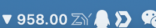
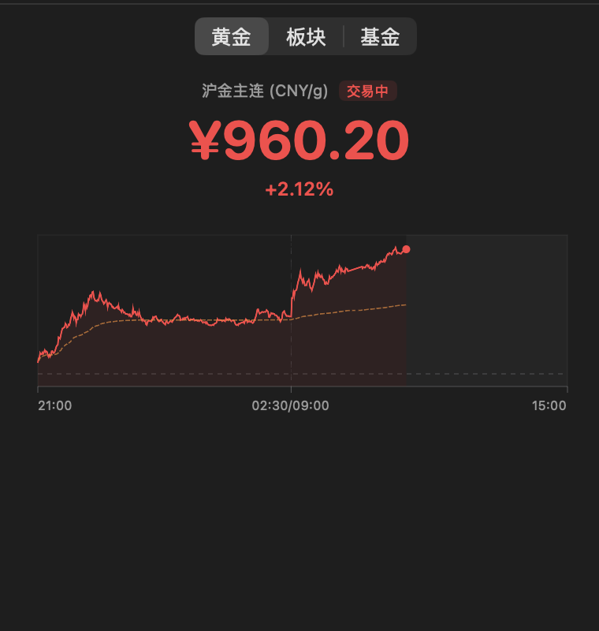
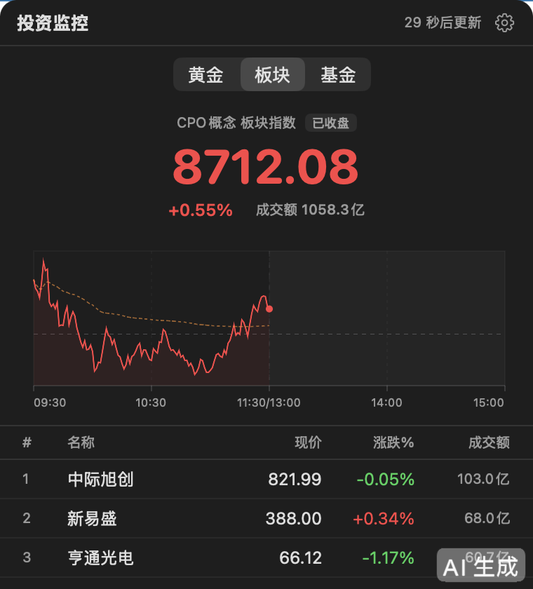
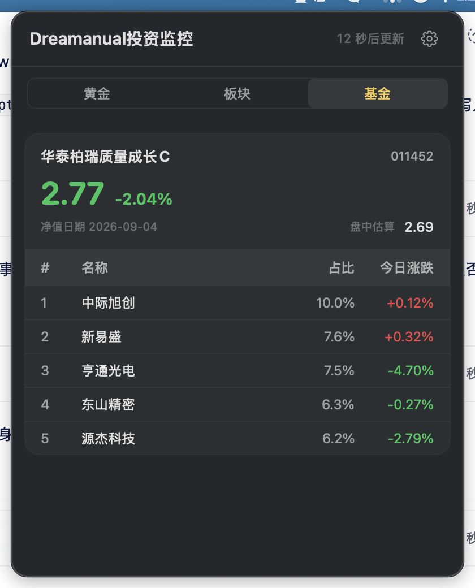
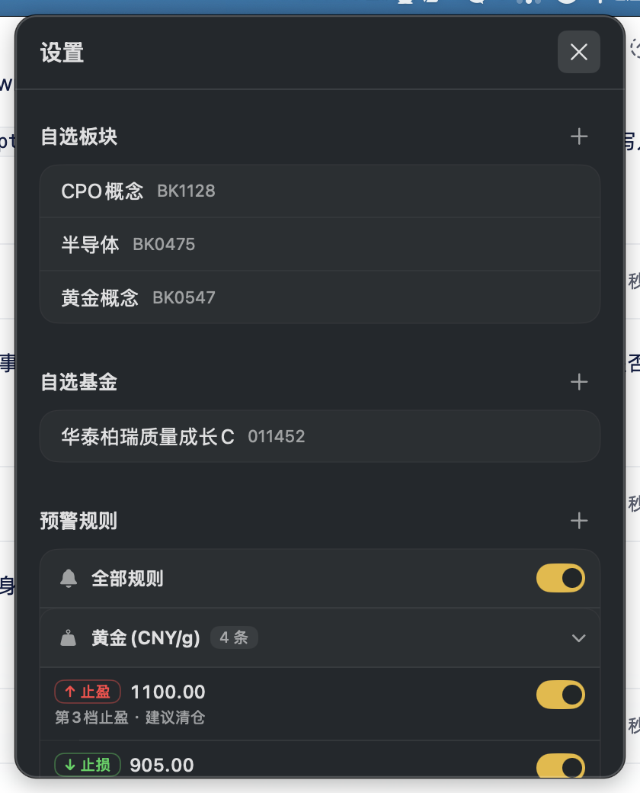

---
AIGC:
  ContentProducer: '001191110102MAD55U9H0F10002'
  ContentPropagator: '001191110102MAD55U9H0F10002'
  Label: '1'
  ProduceID: '72e51607-61f4-4cf9-a340-e4f15970ec6d'
  PropagateID: '72e51607-61f4-4cf9-a340-e4f15970ec6d'
  ReservedCode1: '7a939811-80ab-43c6-87e3-087e9734e98b'
  ReservedCode2: '7a939811-80ab-43c6-87e3-087e9734e98b'
---

# Dreamanual 投资监控

macOS 菜单栏投资监控工具，实时追踪黄金价格、A股板块行情与基金净值，支持多档止盈止损预警通知。

## 功能特性

- **黄金行情**：沪金主连实时价格（CNY/g），匹配招行积存金报价口径，A 股风格分时走势图
- **板块行情**：自定义关注板块，展示指数涨跌与成分股成交额排行，支持多板块切换
- **基金净值**：多只基金净值展示，并发拉取重仓持股实时涨跌，盘中估算净值
- **分时图**：A 股风格分时走势，夜盘+日盘合并显示，均价线参考，Hover 查看任意时间点
- **多档预警**：黄金按价格档位止盈止损、板块/基金按涨跌幅触发，分档操作建议
- **菜单栏常驻**：LSUIElement 应用，不占 Dock，点击菜单栏图标展开面板
- **自动刷新**：按交易时段智能控制刷新频率，收盘后停止刷新
- **原生通知**：系统级通知推送，预警触发时弹出到价提醒

## 截图

### 状态栏



菜单栏常驻显示黄金实时价格与涨跌箭头，点击展开面板。

### 黄金页



- 沪金主连实时价格（CNY/g），交易状态标签
- A 股风格分时图，夜盘+日盘合并显示，均价线参考

### 板块页



- 自定义板块指数涨跌、分时走势图
- 成分股按成交额排序，斑马纹列表一目了然

### 基金页



- 官方净值大数展示，盘中估算净值参考
- 重仓持股实时涨跌，前五大持仓占比一览

### 设置页



- 自选板块/基金增删管理，代码自动识别名称
- 多档止盈止损预警规则配置，支持暂停/启用

## 系统要求

- macOS 12.0+
- Apple Silicon / Intel

## 安装方式

### 方式一：下载 DMG（推荐）

1. 从 [dist/](dist/) 目录下载最新 DMG 文件（[Dreamanual投资监控.dmg](dist/Dreamanual%E6%8A%95%E8%B5%84%E7%9B%91%E6%8E%A7.dmg)）
2. 打开 DMG，将 Dreamanual投资监控.app 拖入「应用程序」文件夹
3. 首次启动需在系统设置 → 隐私与安全性中允许运行
4. 首次启动会请求通知权限，点击「允许」即可

### 方式二：源码编译

```bash
git clone https://github.com/lantian-dreamanual/invest-monitor.git
cd invest-monitor
xcrun swiftc -O \
  InvestmentBarApp.swift \
  MenuBarController.swift \
  Config/AlertConfig.swift \
  Config/ConfigStore.swift \
  Data/DataLayer.swift \
  Data/FundEstimator.swift \
  Alert/AlertEngine.swift \
  Alert/AlertNotifier.swift \
  Alert/AlertRule.swift \
  Panel/AlertView.swift \
  Panel/DesignSystem.swift \
  Panel/FundView.swift \
  Panel/MainPanelView.swift \
  Panel/SectorView.swift \
  Panel/SettingsView.swift \
  Panel/TrendChart.swift \
  UpdateChecker.swift \
  -o "投资监控" \
  -framework SwiftUI -framework AppKit -parse-as-library
```

## 数据来源

所有行情数据来自东方财富网公开接口，无需任何 API Key：

- 黄金：沪金主连行情（SHFE）
- 板块：东财板块指数与成分股
- 基金：东财基金净值与重仓持股

## 技术栈

- **语言**：Swift
- **UI 框架**：SwiftUI + AppKit
- **架构**：菜单栏应用（NSStatusItem + 自定义 NSPanel）
- **设计风格**：对齐 macOS Tahoe 系统设置深色模式，品牌金色主调
- **数据持久化**：UserDefaults（JSON 编码）
- **编译方式**：xcrun swiftc 直接编译，无需 Xcode 项目文件

## 项目结构

```
InvestmentBar/
├── InvestmentBarApp.swift     # App 入口与 AppDelegate
├── MenuBarController.swift     # 菜单栏控制器（数据刷新、状态管理）
├── Info.plist                 # Bundle 配置
├── Config/
│   ├── AlertConfig.swift       # 预警规则存储
│   └── ConfigStore.swift       # 自选板块/基金配置
├── Data/
│   ├── DataLayer.swift         # 数据模型、网络请求、解析器
│   └── FundEstimator.swift     # 基金估值计算
├── Alert/
│   ├── AlertEngine.swift       # 预警引擎（阈值匹配）
│   ├── AlertNotifier.swift     # 通知推送
│   └── AlertRule.swift         # 预警规则模型
└── Panel/
    ├── MainPanelView.swift     # 主面板（Tab 切换、黄金页）
    ├── DesignSystem.swift      # 共享 UI 组件与配色体系
    ├── TrendChart.swift        # 分时图 Canvas 绘制
    ├── SectorView.swift        # 板块页
    ├── FundView.swift          # 基金页
    ├── AlertView.swift         # 预警管理页
    └── SettingsView.swift      # 设置页
```

## 使用说明

1. **黄金**：自动显示沪金主连实时价格与分时图
2. **板块**：在设置页添加关注的板块代码（如 BK0475 半导体），查看指数涨跌与成分股
3. **基金**：在设置页添加基金代码（如 011452），查看净值、盘中估算与重仓持股
4. **预警**：在预警管理页添加多档止盈止损规则，触发后弹出系统通知
5. **刷新**：交易时段自动刷新，收盘后停止

## 开发者

蓝添 (Dreamanual)

## 许可证

MIT License

> AI生成